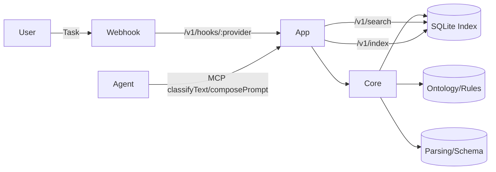
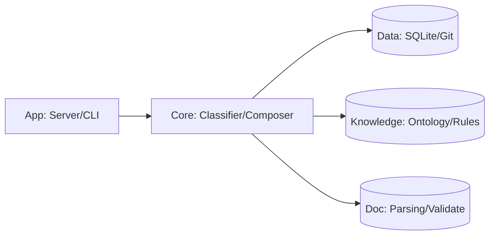
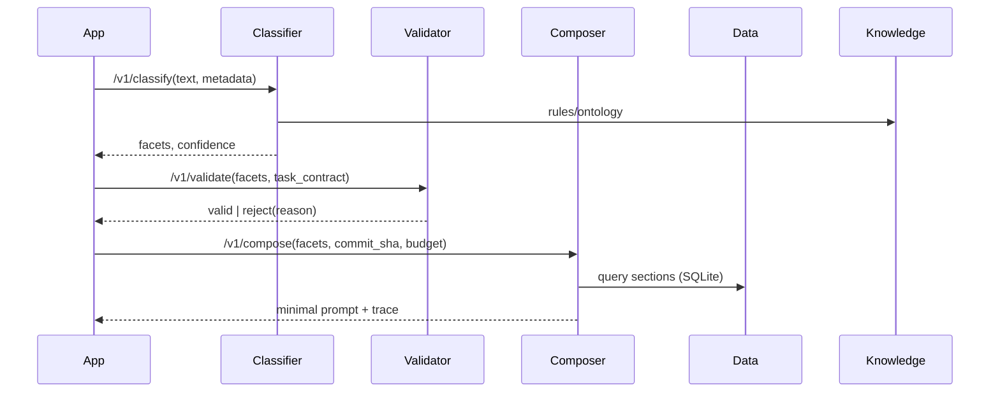

1. CODEBASE_INDEX.md (프로젝트 대시보드)

---
title: Codebase Index
last_updated: 2025-08-19
project: ctxset (Deterministic Prompt Router & Composer)
version: v1.0.0
---

# Codebase Index

## 1. Purpose
- 이 문서는 **프롬프트 결정성/유사-결정성**을 제공하는 컨텍스트/프롬프트 서비스의 진입점입니다.
- 사람과 AI가 **같은 입력 → 같은 출력**, **비슷한 입력 → 유사한 출력**을 얻도록 구조/규칙/흐름을 제공합니다. (중앙 상수/임계 관리)  [oai_citation:6‡ARCHITECTURE.md](file-service://file-5V8VTGRypaEMaXLFYE7aqE)

## 2. Principles
- UI → Domain 단방향, I/O 분리, 공용 상수/오류 중앙화.  [oai_citation:7‡ARCHITECTURE.md](file-service://file-5V8VTGRypaEMaXLFYE7aqE)
- Feature ↔ Feature 직접 참조 금지(경계 유지).  [oai_citation:8‡ARCHITECTURE.md](file-service://file-5V8VTGRypaEMaXLFYE7aqE)
- 외부 I/O는 Data 레이어만(서버/CLI는 코어 호출 전용).  [oai_citation:9‡ARCHITECTURE.md](file-service://file-5V8VTGRypaEMaXLFYE7aqE)

## 3. System Overview (C4 요약)
- Context: 사용/외부 시스템(Webhook, LLM MCP)  [oai_citation:10‡INTEGRATION_GUIDE.md](file-service://file-3xZjv8YvazqtoUrbVoAgNY)  [oai_citation:11‡INTEGRATION_GUIDE.md](file-service://file-3xZjv8YvazqtoUrbVoAgNY)
- Containers: App(Server/CLI), Core(분류/합성), Data(SQLite Index), Knowledge(온톨로지/룰)  [oai_citation:12‡ARCHITECTURE.md](file-service://file-5V8VTGRypaEMaXLFYE7aqE)
- 주요 Components: classifier/normalizer/validator, composer(scorer/selector/merger/query)  [oai_citation:13‡ARCHITECTURE.md](file-service://file-5V8VTGRypaEMaXLFYE7aqE)

## 4. Module Map (자동 생성)
```yaml
modules:
  - name: app
    responsibility: HTTP/MCP/CLI 진입점(핸들러/DTO)
    depends_on: [core, doc, data]
  - name: core/classifier
    responsibility: 결정적 분류(룰+온톨로지), 정규화/정합성 검사
    depends_on: [common, knowledge, doc]
  - name: core/composer
    responsibility: 레시피 기반 프롬프트 합성(스코어러/선택/병합)
    depends_on: [common, knowledge, doc]
  - name: data/index
    responsibility: SQLite 인덱스(섹션/문서 스냅샷)
    depends_on: [common]
  - name: knowledge
    responsibility: ontology/rules 관리
    depends_on: [common]
  - name: doc
    responsibility: 파싱/스키마/검증
    depends_on: [common, knowledge]


⸻

2) 폴더 구조 (Lean)

src/
├─ common/               # 공통 타입/상수/에러/유틸리티 (모든 레이어에서 사용 가능)
│  ├─ constants/{scoring.rs, parsing.rs, validation.rs, defaults.rs, graph.rs}
│  ├─ errors.rs
│  └─ utils.rs
├─ knowledge/            # 온톨로지/룰 (I/O + 계산 분리)
│  ├─ ontology/{mod.rs, schema.rs}
│  └─ rules/{loader.rs, applier.rs, schema.rs}
├─ doc/                  # 문서 처리(파싱/스키마/검증)
│  ├─ parse/{frontmatter.rs, document.rs, section.rs}
│  ├─ schema/{v1.rs, document.rs}
│  └─ validate/{pipeline.rs, stages/{metadata.rs, schema.rs, structure.rs}}
├─ core/                 # 비즈니스 핵심(분류/조합)
│  ├─ classifier/{facet.rs, normalizer.rs}
│  ├─ composer/{types.rs, scorer/{keyword.rs, freshness.rs, similarity.rs, facet_coverage.rs}, selector.rs, merger.rs, query.rs}
│  ├─ dependency/{standard.rs}
│  └─ transformer/
├─ data/                 # 데이터 접근 (SQLite 인덱스, 스토리지)
│  ├─ index/{sqlite.rs}
│  ├─ storage/{local.rs}
│  ├─ git/
│  └─ id/
├─ app/                  # 외부 인터페이스 (서버/CLI)
│  ├─ server/{http.rs, dto.rs}               # feat: server (+ webhook endpoints)
│  └─ cli/{app.rs, utils.rs, commands/{classify.rs, import.rs, parse.rs, github.rs, server.rs, mcp.rs}}   # feat: cli (+ MCP server)
└─ lib.rs

	•	최상위 폴더는 6개: common / knowledge / doc / core / data / app
	•	내부는 필요한 만큼 세분화하되, 경계(폴더)는 그대로 유지한다.
	•	상세 파일 구조는 [FILE_STRUCTURE.md](./FILE_STRUCTURE.md) 참조

⸻


5. Critical Flows
	•	Prompt Compose: /v1/classify → /v1/validate → /v1/compose 표준 플로우.  
	•	Webhook 수신: POST /v1/hooks/:provider로 태스크 수신→분류/게이팅.  
	•	MCP: classifyText/composePrompt로 에이전트 통합.  

6. External Interfaces
	•	REST: /v1/classify, /v1/validate, /v1/compose, /v1/index, /v1/search  
	•	MCP(JSON-RPC): ping, classifyText, composePrompt (샘플 요청/응답 포함)    

7. Ownership
	•	CODEOWNERS: ./CODEOWNERS (코어/지식/데이터/앱 영역별 코드오너)

8. Decisions
	•	ADRs: ./adr/ (결정/대안/영향 기록)

9. Determinism & Similarity-stable Policy(핵심)
	•	동일 입력 → 동일 출력: 정규화 + 룰/레시피/가중치/commit_sha/상수 버전 해시로 Execution ID 고정.
	•	유사 입력 → 유사 출력: SIMILARITY_THRESHOLD 이상이면 동일 레시피/유사 스니펫 조합(상수 중앙화).  
	•	Intent Gate: 태스크 카테고리↔행위(action) 불일치 거부/가이드.  
```

---

# 2. `c4-diagrams/` (텍스트 기반 다이어그램)

### `c4-diagrams/context.md`
```markdown
# Context Diagram — Deterministic Prompt Service

- Users: PM/엔지니어/리뷰어
- External Systems: Issue Trackers(Linear/GitHub/Jira), LLM Agents(MCP), VCS(Git)



### `c4-diagrams/container.md`
```markdown
# Container Diagram — Lean 6 Layers

- App(Server/CLI)은 코어만 호출, 파일/DB는 Data 레이어로 위임.  [oai_citation:23‡ARCHITECTURE.md](file-service://file-5V8VTGRypaEMaXLFYE7aqE)



### `c4-diagrams/component.md`
```markdown
# Component Diagram — Classify→Validate→Compose



---

# 3. `adr/` (Architecture Decision Records)

### `adr/0001-similarity-stable-determinism.md`
```markdown
# ADR 0001 — Similarity-stable Determinism for Prompt Composition
- Status: Accepted (2025-08-19)

## Context
동일한 태스크 입력은 희귀. 실무에서는 "비슷한" 태스크가 반복된다. 따라서 "동일 입력=동일 출력"과 함께 "유사 입력=유사 출력"을 **명시적 정책**으로 채택하고, 상수/임계값/가중치/레시피 버전으로 제어한다. (상수 중앙화)  [oai_citation:24‡ARCHITECTURE.md](file-service://file-5V8VTGRypaEMaXLFYE7aqE)

## Decision
1) **Execution ID** = hash(canonical_input, rules_version, recipe_version, commit_sha, constants_version).  
2) **Similarity-stable 합성** = facet 일치도 + 텍스트 유사도 + 구조 유사도 가중합 ≥ `SIMILARITY_THRESHOLD`면 동일 레시피/유사 스니펫 세트 사용.  [oai_citation:25‡ARCHITECTURE.md](file-service://file-5V8VTGRypaEMaXLFYE7aqE)  
3) **Intent Gate**로 카테고리↔action 불일치 즉시 거부. API `/v1/classify|validate|compose` 흐름 표준화.  [oai_citation:26‡ARCHITECTURE.md](file-service://file-5V8VTGRypaEMaXLFYE7aqE)

## Alternatives
- 전면 LLM 판단: 결정성·재현성 저하.
- 룰만 사용: 저신뢰 케이스 처리 곤란 → LLM Assist는 **임계치 미만**에서만 보조.  [oai_citation:27‡PLAN.md](file-service://file-NbprB8xM2fRaQRwwdXRnCK)

## Consequences
- 재현성/Audit 용이, **유사-결정성**으로 운영 예측 가능.
- 정책/상수 변경은 버전 승격으로 추적.

adr/0002-api-surface-and-integration.md

# ADR 0002 — Public API Surface & Integrations
- Status: Accepted (2025-08-19)

## Decision
- REST: `/v1/classify`, `/v1/validate`, `/v1/compose`, `/v1/index`, `/v1/search` 유지. 핸들러는 코어 호출 전용.  [oai_citation:28‡ARCHITECTURE.md](file-service://file-5V8VTGRypaEMaXLFYE7aqE)  
- Webhook: `POST /v1/hooks/:provider` 수신 스펙 고정.  [oai_citation:29‡INTEGRATION_GUIDE.md](file-service://file-3xZjv8YvazqtoUrbVoAgNY)  
- MCP: `classifyText`, `composePrompt`를 표준 JSON-RPC로 노출. 샘플 페이로드/응답 명세 채택.  [oai_citation:30‡INTEGRATION_GUIDE.md](file-service://file-3xZjv8YvazqtoUrbVoAgNY)  [oai_citation:31‡INTEGRATION_GUIDE.md](file-service://file-3xZjv8YvazqtoUrbVoAgNY)

## Consequences
- 다양한 에이전트/이슈트래커 통합 용이.
- 네트워크/인증/로그 가이드 준수 필요.  [oai_citation:32‡INTEGRATION_GUIDE.md](file-service://file-3xZjv8YvazqtoUrbVoAgNY)


⸻

4. ARCHITECTURE.md (불변 규칙 + CI/CD 검증 일치)

# Architecture Rules — ctxset v1.0.0

## Module Boundaries (Lean 6)
- allow: app → core/doc/data (코어 호출 전용, 파일/DB는 data로 위임)  [oai_citation:33‡ARCHITECTURE.md](file-service://file-5V8VTGRypaEMaXLFYE7aqE)
- allow: core → common/knowledge/doc (의존 규칙 준수)  [oai_citation:34‡ARCHITECTURE.md](file-service://file-5V8VTGRypaEMaXLFYE7aqE)
- allow: data → common (core/doc/knowledge 직접 참조 금지)  [oai_citation:35‡ARCHITECTURE.md](file-service://file-5V8VTGRypaEMaXLFYE7aqE)
- deny: feature↔feature 직접 참조, core→app 역참조, app→knowledge 직접.  [oai_citation:36‡ARCHITECTURE.md](file-service://file-5V8VTGRypaEMaXLFYE7aqE)

## API Surface (검증 대상)
- POST `/v1/classify` → `{facets, score, evidence}`
- POST `/v1/validate` → `{valid, issues, suggestions}`
- POST `/v1/compose` → `{sections, merged, trace}`
- POST `/v1/index`, GET `/v1/search` (서버 핸들러는 코어만 호출)  [oai_citation:37‡ARCHITECTURE.md](file-service://file-5V8VTGRypaEMaXLFYE7aqE)

## Determinism & Similarity-stable (강제 규칙)
1) **Canonicalization**  
   - 입력 정규화: 공백/마크다운/코드펜스/경로/URL/날짜 표준화 → `canonical_input` 생성(해시 입력).  
   - 문맥 버전: `repo, branch, commit_sha` 필수. 같은 commit_sha에서만 동일성 비교 허용. (인덱스 API 요구)  [oai_citation:38‡FILE_STRUCTURE.md](file-service://file-VScQ1XcTAGm7E6VrjUwKFH)
2) **Execution ID**  
   - `exec_id = hash(canonical_input, rules_version, recipe_version, commit_sha, constants_version)` (idempotent 재실행).
3) **Similarity-stable Policy**  
   - `similarity = w_facet·FacetSim + w_text·TextSim + w_struct·StructSim`  
   - `similarity ≥ SIMILARITY_THRESHOLD` → 동일 레시피 및 유사 스니펫 집합 채택. (상수 중앙화)  [oai_citation:39‡ARCHITECTURE.md](file-service://file-5V8VTGRypaEMaXLFYE7aqE)
4) **Intent Gate (Policy)**  
   - 태스크 계약에서 **허용 action**만 통과(예: `legacy_edit` → {refactor, migrate}만). 불일치 시 거부 + 허용 목록 안내.  [oai_citation:40‡ARCHITECTURE.md](file-service://file-5V8VTGRypaEMaXLFYE7aqE)

## Composer Rules
- 스코어러 가중치/타이브레이커는 공용 상수로 고정 (`scoring.rs`, `validation.rs`).  [oai_citation:41‡ARCHITECTURE.md](file-service://file-5V8VTGRypaEMaXLFYE7aqE)
- 선택 가능한 **스니펫 상한**, **MMR lambda**, **freshness weight**는 constants에서만 변경. CI로 diff 감지.  [oai_citation:42‡ARCHITECTURE.md](file-service://file-5V8VTGRypaEMaXLFYE7aqE)

## Classifier Rules
- 규칙 기반(정규식/키워드/링크/코드펜스) + 정합성 검사(implies/conflicts). 임계 미만만 LLM Assist.  [oai_citation:43‡PLAN.md](file-service://file-NbprB8xM2fRaQRwwdXRnCK)  [oai_citation:44‡PLAN.md](file-service://file-NbprB8xM2fRaQRwwdXRnCK)

## Documents & Numbering
- Story 단위 **단일 tasks.md** 유지(관계/추적성/프롬프트 최적화), 표준 번호 체계(REQ/DES/Task/AC).  [oai_citation:45‡SYSTEM_OVERVIEW.md](file-service://file-QcuFd9HRXWti24CFcMectU)  [oai_citation:46‡SYSTEM_OVERVIEW.md](file-service://file-QcuFd9HRXWti24CFcMectU)

## CI/CD Architecture Guards
- trybuild로 역참조 금지 테스트, clippy 경고 금지, 금지 룰 엄격 적용.  [oai_citation:47‡ARCHITECTURE.md](file-service://file-5V8VTGRypaEMaXLFYE7aqE)


⸻

부록) 구현에 바로 쓰는 핵심 스펙(요지)
	•	입력 DTO
	•	/v1/classify: { text, metadata? } → { facets, score, evidence }  
	•	/v1/validate: { facets, task_contract } → { valid, issues[], suggestions[] } (정책 일치)  
	•	/v1/compose: { facets, repo, branch, commit_sha, budget } → { sections[], merged, trace }  
	•	유사-결정성 계산
	•	FacetSim: Jaccard over categorical facets
	•	TextSim: 토큰 코사인(정규화 토크나이저)
	•	StructSim: REQ/DES/Task/AC 참조 비율 비교
	•	파라미터: SIMILARITY_THRESHOLD, DEFAULT_MMR_LAMBDA, DEFAULT_FRESHNESS_WEIGHT 등은 중앙 상수.    
	•	거부 규칙
	•	카테고리↔action 불일치(예: legacy_edit × design)는 즉시 거부 + 허용 액션 안내.  
	•	연동
	•	Webhook POST /v1/hooks/:provider (토큰 헤더 필수), MCP classifyText/composePrompt 샘플 스펙 제공.    
	•	보안/운영
	•	토큰/HMAC(계획), HTTPS, 방화벽, 레이트리밋, 민감정보 로그 금지, 헬스체크/트러블슈팅 가이드.    

⸻


CTXSET 아키텍처 (Lean 모드)

버전: 1.0
작성일: 2025-08-12
목적: 최소 폴더 수(6~8개)로 경계를 유지하면서, CLI/서버/Web UI까지 확장 가능한 컨텍스트 엔지니어링 플랫폼의 코어 구조를 정의한다.

⸻

1) 설계 원칙
	1.	단방향 의존성
types → knowledge → doc → core → app 순으로만 참조. 반대 참조 금지.
	2.	I/O와 순수 계산 분리
로더/저장은 knowledge/loader, data/에서만. 분류/스코어링은 core/.
	3.	공용 상수/에러 중앙화
매직 넘버·문자열 금지 → types/constants/*에서만 정의·노출.
	4.	공유 코어, 진입점 분리
비즈니스 로직은 core/에만. app/server, app/cli는 코어 호출 전용.
	5.	Feature 플래그로 가시성 축소
server, cli, dep-graph 등은 필요 시에만 컴파일.

3) 의존 규칙
	•	common → 누구나 사용 가능 (타입/상수/에러/유틸리티)
	•	knowledge → common만 참조
	•	doc → common, knowledge 참조 가능(온톨로지 기반 파싱 정규화)
	•	core → common, knowledge, doc 참조
	•	data → common만 참조 (core를 보지 않음)
	•	app → common, knowledge, doc, core, data 참조 (app은 코어 호출 전용)

금지: app → knowledge 직접 참조, core → app 역참조, data → core/doc/knowledge 참조.
