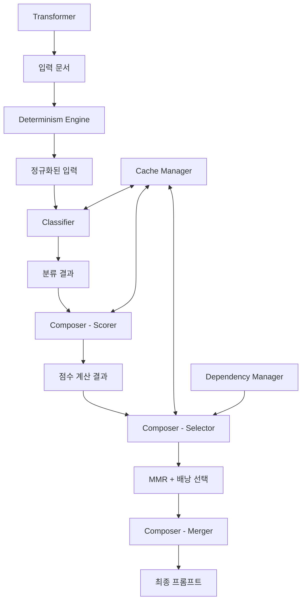

# Core 모듈

CtxSet의 핵심 비즈니스 로직을 담당하는 모듈로, 문서 분류, 조합, 의존성 관리 등의 핵심 기능을 제공합니다.

## 아키텍처 개요

Core 모듈은 다음과 같은 하위 모듈들로 구성됩니다:

```
core/
├── cache/           # 계산 캐싱 시스템
├── classifier/      # 문서 분류 엔진
├── composer/        # 문서 조합 엔진 (MMR + 배낭 알고리즘)
├── dependency/      # 의존성 그래프 관리
├── transformer/     # 문서 변환 엔진
└── determinism.rs   # 결정성 엔진 (유사-안정 캐싱)
```

## 주요 모듈 소개

### 1. Determinism Engine (`determinism.rs`)

동일한 입력에 대해 동일한 결과를, 유사한 입력에 대해 유사한 결과를 제공하는 결정성 엔진입니다.

**핵심 기능:**
- 입력 정규화: 텍스트, 패싯, 메타데이터 정규화
- 실행 ID 생성: 정규화된 입력 기반 해시 생성
- 텍스트 정규화: 공백, 마크다운 헤더, 코드 펜스, URL 정규화
- 버전 관리: 시스템 상수 및 알고리즘 버전 추적

**주요 구조:**
- `CanonicalInput`: 정규화된 입력 데이터
- `ExecutionContext`: 실행 컨텍스트 정보 (ID, 해시, 버전, 생성 시각)
- `DeterminismEngine`: 정규화 및 해시 생성 엔진

### 2. Classifier (`classifier/`)

온톨로지 기반 패싯 분석을 통해 문서를 분류하는 엔진입니다.

**주요 컴포넌트:**
- `ClassifierEngine`: 규칙 기반 분류 엔진 (정규식 미리 컴파일)
- `Classification`: 분류 결과 및 신뢰도 관리
- `Normalizer`: 토큰/동의어/패스 정규화
- `ClassifierService`: 앱 레이어용 파사드

**분류 방식:**
- 키워드 매칭 (YAML 규칙 우선, 레거시 규칙 보조)
- 정규식 매칭 (가중치 기반)
- 링크 호스트 매칭
- 정합성 검사 (prohibited/requires 규칙)
- 증거 기반 신뢰도 계산 (포화 함수 사용)

### 3. Composer (`composer/`)

MMR(Maximal Marginal Relevance) + 배낭 알고리즘으로 최적 문서 조합을 생성합니다.

**주요 컴포넌트:**
- `BuildComposer`: 메인 조합 엔진
- `DocumentScorer`: 문서 점수 계산
- `DocumentSelector`: MMR 알고리즘 + 토큰 예산 제약 처리
- `DocumentMerger`: 선택된 문서들의 병합

**조합 과정:**
1. 문서별 기본 점수 계산 (키워드, 신선도, 신뢰도 등)
2. MMR로 중복 억제하며 선택
3. 선택된 문서들을 병합하여 최종 프롬프트 생성

**MMR 공식:**
```
MMR(d) = λ * relevance(d) - (1-λ) * max_{s∈S} similarity(d,s)
```

### 4. Dependency (`dependency/`)

문서 간 의존 관계를 분석하고 최적화하는 모듈입니다.

**핵심 기능:**
- 의존성 관계 추가 및 관리
- 순환 의존성 탐지 (DFS 기반)
- 토폴로지 정렬 (빌드 순서 결정)
- 의존성 통계 제공

**구현체:**
- `DependencyGraphManager` trait
- `StandardDependencyGraphManager`: 표준 구현

### 5. Cache (`cache/`)

비용이 많이 드는 계산들을 캐싱하여 성능을 최적화하는 시스템입니다.

**주요 컴포넌트:**
- `MemoryCache`: LRU 기반 메모리 캐시
- `CacheManager`: 여러 캐시 통합 관리
- `ScoringCacheManager`: 점수 계산 캐싱
- `SimilarityCacheManager`: 유사성 계산 캐싱

**캐시 종류:**
- 유사성 캐시: 문서 간 유사도 계산 결과
- 점수 캐시: 문서 점수 계산 결과
- 문서 캐시: 문서 내용 캐시
- 쿼리 결과 캐시: 검색 결과 캐시

### 6. Transformer (`transformer/`)

비표준 마크다운을 표준 contexts 형식으로 변환하는 엔진입니다.

**핵심 기능:**
- frontmatter 자동 생성
- 제목 추출 (첫 번째 # 헤딩 또는 첫 줄)
- 섹션 자동 감지 (## 헤딩 기반)
- 태그 추론 (기술 키워드 감지)
- 변환 가능성 검사

**구현체:**
- `Transformer` trait
- `StandardTransformer`: 표준 변환기

## 데이터 플로우



## 성능 최적화

### 캐싱 전략
- **LRU 캐시**: 메모리 효율적인 캐시 관리
- **TTL 기반 만료**: 시간 기반 캐시 무효화
- **배치 처리**: 대량 계산의 효율적 캐싱
- **계층적 캐싱**: 유사성, 점수, 문서, 쿼리 결과 각각 최적화된 TTL

### 알고리즘 최적화
- **정규식 미리 컴파일**: 분류 엔진 성능 향상
- **MMR 재정렬**: 상위 후보만으로 제한하여 성능 확보
- **그리디 폴백**: 작은 집합에서는 간단한 알고리즘 사용
- **배낭 임계값**: 큰 예산에서는 그리디 알고리즘으로 대체

## 확장 가능성

### 새로운 분류기 추가
```rust
impl ClassifierEngine {
    pub fn with_custom_rules(&mut self, custom_rules: CustomRuleSet) -> &mut Self {
        // 커스텀 분류 규칙 추가
    }
}
```

### 새로운 캐시 백엔드 추가
```rust
pub trait CacheBackend {
    fn get(&self, key: &str) -> Option<Vec<u8>>;
    fn put(&self, key: &str, value: Vec<u8>);
}
```

### 새로운 변환기 추가
```rust
impl Transformer for CustomTransformer {
    fn transform(&self, content: &str, hint: Option<TransformHint>) -> Result<String> {
        // 커스텀 변환 로직
    }
}
```

## 에러 처리

모든 모듈은 `ContextError`를 통한 일관된 에러 처리를 제공합니다:
- `ConfigError`: 설정 관련 오류
- `AssemblyError`: 문서 조립 오류
- `Io`: 파일 I/O 오류
- `Other`: 기타 오류

## 테스트 전략

각 모듈은 포괄적인 테스트를 제공합니다:
- **단위 테스트**: 개별 함수 및 메서드 테스트
- **통합 테스트**: 모듈 간 상호작용 테스트
- **벤치마크 테스트**: 성능 측정 및 최적화 검증
- **속성 기반 테스트**: 다양한 입력에 대한 불변속성 검증

## 사용 예시

### 문서 분류
```rust
use ctxset::core::classifier::{ClassifierEngine, ClassifierService};

let result = ClassifierService::classify_with_yaml(
    ontology_yaml,
    rules_yaml,
    "Rust API Guide",
    "This guide covers Rust API development..."
)?;

println!("분류 결과: {:?}", result.facets());
println!("신뢰도: {:.2}", result.confidence());
```

### 문서 조합
```rust
use ctxset::core::composer::{BuildComposer, BuildQuery};

let composer = BuildComposer::new();
let query = BuildQuery::new("my-repo".to_string(), "main".to_string(), "abc123".to_string());
let result = composer.compose(candidates, &query, 4000, 200)?;

println!("조합된 프롬프트 토큰 수: {}", result.merged_document.tokens);
```

### 캐시 활용
```rust
use ctxset::core::cache::global_cache_manager;

let cache = global_cache_manager();
if let Some(cached_score) = cache.get_score(doc_hash, query_hash) {
    // 캐시에서 점수 사용
} else {
    let computed_score = compute_score(...);
    cache.put_score(doc_hash, query_hash, computed_score);
}
```

## 설정 상수

주요 설정값들은 `common/constants/`에서 중앙 관리됩니다:
- `scoring.rs`: 점수 계산 가중치 및 임계값
- `composition.rs`: 조합 알고리즘 파라미터
- `determinism.rs`: 정규화 및 해시 설정
- `defaults.rs`: 기본 캐시 크기 및 TTL

이를 통해 시스템 전체의 동작을 일관되게 제어할 수 있습니다.